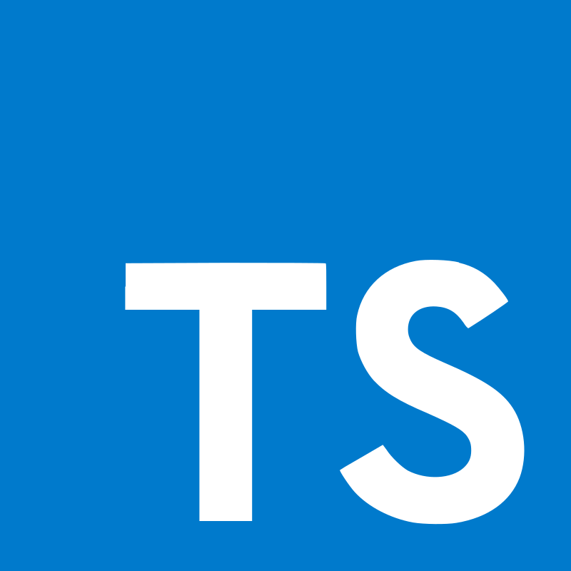

<h1 align="center">
  
</h1>

<h5 align="center">
  <code><a href="https://www.linkedin.com/in/emran-kamil" title="LinkedIn Profile"> LinkedIn</a></code>
  <code><a href="https://leetcode.com/emexnord" title="Leetcode Profile"> Leetcode</a></code>
  <code><a href="https://t.me/emex_nord" title="Telegram Profile"> Telegram</a></code>
  <code><a href="https://codeforces.com/profile/emexnord" title="Codeforces Profile"> Codeforces</a></code>
</h5>
 
<!-- 

  

 -->

## About Me

Hello, I'm Emran Kamil, a Full-stack Developer specializing in backend development.

💻 I'm experienced in utilizing Node.js, Python, and Go to build world-class products.

📚 I'm a Computer Engineer, and right now, I'm deep into learning advanced Machine Learning and AI — it's an exciting journey to grow and innovate.

💬 Ask me anything [here](https://github.com/emexnord/emexnord/issues).

📫 How to reach me: [emran.kamil@a2sv.org](mailto:emranhi001@gmail.com)

 

## Languages

## Technology Stack

## Databases

<h2 align="center">⚡ Stats ⚡</h2>
 

  

    
    
  

           
  

    
  

   

  

<h2 align="center">👨‍💻 Repositories 👨‍💻</h2>
 

  
  

      

  
  

      

  
  

      

<h4 align="center">
  <a href="https://github.com/emexnord?tab=repositories" title="Show Repositories">🔎 Show More 🔍</a>
</h4>
